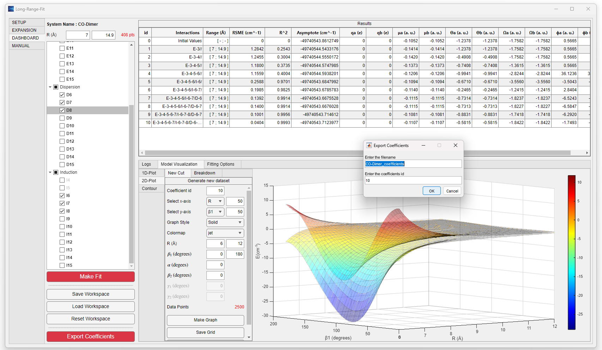

# Long-Range-Fit

## Background

The study of intermolecular forces is essential for predicting and understanding the dynamics of molecular systems, which can be relevant to numerous scientific disciplines, including atmospheric chemistry, environmental chemistry, and astrochemistry. Recent discoveries of complex organic and especially chiral molecules in the interstellar medium have drawn much interest, and theory and simulation are important partners to experimental measurements in these efforts. Interactions between molecules in the gas phase can be separated into short- or long-range forces, depending on whether their molecular electronic clouds overlap. For modelling purposes, these interactions can be better understood and represented by constructing a potential energy surface (PES) for the system of interest.

A software package "Long-Range-Fit" (LRF) was developed, implementing a physically rigorous description of interactions in the long-range region, namely electrostatic, induction, and dispersion. An interactive user-friendly interface connects the user to the underlying sophisticated high-order mathematical treatment. Moreover, the accompanying source code, LRF-Integration, allows users to merge the long-range model from LRF with any independent short-range approach by utilizing the coefficients file exported by LRF.


## Installation and Usage
### -Fortran
Go to the folder "Fortran-03", download the file named "LRF.f90" and place it in the project directory. Below is a minimal Fortran example demonstrating how to invoke evaluate_LRF (evaluate_LR returns the Potential Energy for a given set of coefficients exported employing LRF v4.x)
evaluate_LR needs as function parameters:
 - Energy (Output, Real): Interaction energy between the monomers (in cm^-1).
 - XDIM (Input, Integer): Number of degrees of freedom in the system.
 - COORDINATE_FORMAT (Input, Char): Euler convention used to describe the monomers’ orientation.
 - coordinates(XDIM) (Input, Real): Intermolecular distance (Å) followed by the angles (in degrees) describing the orientation.
 - PATH_TO_COEFFICIENTS (Input, Char): Path to the coefficients file containing the long-range coefficient expansion. 
 
```fortran
program example

 implicit none
 integer (kind=4), parameter:: XDIM=6  ! Coordinates Dimensions
 character (len=*,kind=1), parameter:: COORDINATE_FORMAT = "Euler_ZYZ"   ! Coordinate Format
 character (len=*,kind=1), parameter:: PATH_TO_COEFFICIENTS = "../testing_datafiles/coefficients/C1(1)_C1(1)_Coeff.txt"

 real (kind=8):: energy    ! Interaction Energy
 real (kind=8), dimension(XDIM):: coordinates = [10.27d0,& ! R
                                                  30d0,&    ! beta1
                                                  20d0,&    ! beta2
                                                  120d0,&   ! alpha
                                                  0d0,&     ! gamma1
                                                  0d0]      ! gamma2


 ! Evaluate the Potential Energy Surface in the Long-Range region
 call evaluate_LRF( energy,&
                    XDIM,&
                    coordinates,&
                    COORDINATE_FORMAT,&
                    PATH_TO_COEFFICIENTS&
                  )

end program example
   ```
To obtain the coefficients file by clicking the “Export Coefficients” button in LRF software  


For detailed instructions on how to use LRF to obtain the coefficient file, please refer to the user manual( <a href="https://github.com/dawesr-repo/LRF-Integration/blob/Updating-Readme/LRF_User_Manual.pdf" >LRF User Manual</a>)
## Credits
Research Group:
- Ernesto Quintas-Sanchez
- Richard Dawes (Advisor)

This work was partially supported by the Missouri University of Science and Technology’s Kummer Institute for Student Success and the United States Department of Energy (DOE), grant numbers DE-SC0019740 and DE-SC0025420.


